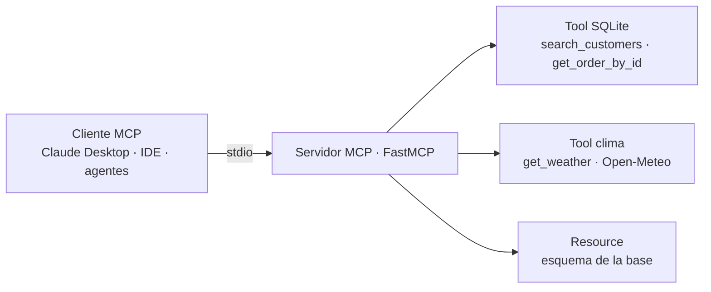

<p align="center">
<a href="https://www.linkedin.com/in/soriamaximilianorodrigo/" target="_blank" rel="noopener noreferrer">
</a>
</p>

<p align="center">
  <a href="#"></a>
  <a href="#"></a>
  <a href="#"></a>
  <a href="#"></a>
</p>

<p align="center">
  <a href="https://github.com/DietrichGebert/ponytail"></a>
  
  
</p>

<p align="center">
  
</p>

<!-- dynamic-badges -->
<p align="center">
  <a href="https://github.com/MaximilianoRodrigoSoria/mcp-server-demo/actions"></a>
  <a href="LICENSE"></a>
  
  
  <a href="https://maximilianorodrigosoria.github.io/mcp-server-demo/"></a>
  
</p>

<hr/>

<h1 align="center">mcp-server-demo</h1>

<p align="center">
Servidor <b>MCP (Model Context Protocol)</b> que expone herramientas propias
(consultas a una base SQLite y a una API externa) para que un LLM las use de forma estandarizada.
</p>

## Objetivo

Demostrar dominio del protocolo abierto que está estandarizando cómo los LLM acceden a herramientas y datos externos. En vez de acoplar tools a un framework concreto, se construye un servidor MCP reutilizable por cualquier cliente compatible (Claude Desktop, el sistema multi-agente de este portfolio, IDEs, etc.).

El servidor expone, como mínimo:

- **Tools** — acciones invocables: consultar una base de datos local (SQLite) y llamar a una API externa (ej. clima, tipo de cambio, o una API pública de datos).
- **Resources** — datos legibles por el modelo (ej. el esquema de la base, un catálogo).
- (Opcional) **Prompts** — plantillas de prompt reutilizables parametrizadas.

## Stack tecnológico

- **Opción A — Python:** SDK oficial `mcp` (con `FastMCP`) — recomendado por rapidez de desarrollo
- **Opción B — TypeScript:** `@modelcontextprotocol/sdk` — útil si se quiere mostrar versatilidad
- **Transporte:** `stdio` para uso local con clientes de escritorio; **Streamable HTTP** para exposición remota
- **Base de datos:** SQLite (con un dataset de ejemplo sembrado)
- **API externa:** una API pública sin fricción (ej. Open-Meteo para clima, o exchangerate.host)
- **Validación:** Pydantic (Python) o Zod (TS)
- **Cliente de prueba:** MCP Inspector (`npx @modelcontextprotocol/inspector`) y/o Claude Desktop
- **Testing / calidad:** pytest (o vitest), ruff/black (o eslint/prettier)

## Estructura de carpetas (variante Python)

```
mcp-server-demo/
├── README.md
├── pyproject.toml
├── .env.example
├── data/
│   ├── seed.sql             # Esquema + datos de ejemplo
│   └── demo.db              # SQLite generada (git-ignored)
├── src/
│   ├── server.py            # Entry point: instancia FastMCP y registra todo
│   ├── config.py
│   ├── tools/
│   │   ├── db_tools.py      # query_customers, get_order_by_id, etc.
│   │   └── api_tools.py     # get_weather, get_exchange_rate, etc.
│   ├── resources/
│   │   └── schema.py        # Expone el esquema de la DB como resource
│   └── db/
│       └── connection.py    # Conexión y helpers (queries parametrizadas)
├── scripts/
│   └── seed_db.py           # Crea demo.db desde seed.sql
├── examples/
│   └── claude_desktop_config.json  # Config de ejemplo para registrar el server
└── tests/
    ├── test_db_tools.py
    └── test_api_tools.py
```

---

<!-- diagrama-mermaid -->
## 📊 Diagrama


